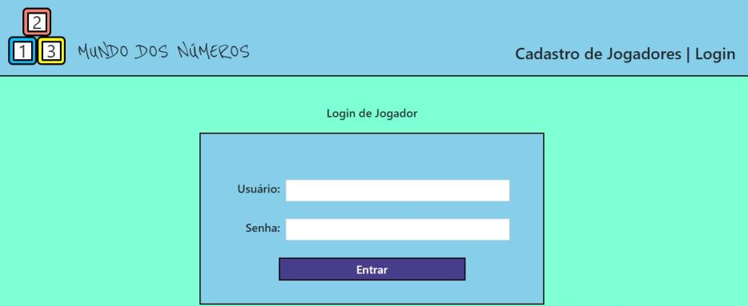
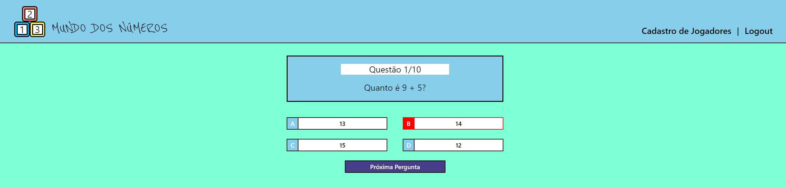
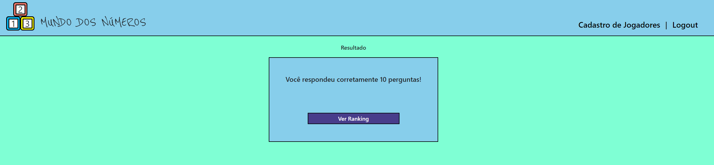
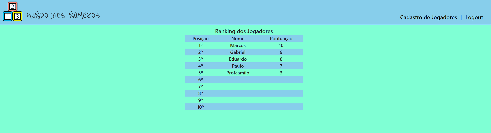

  

# Projeto Integrador ADS 2021/1
 ## Descrição do Projeto
<p align="center">Aplicação Web de Quiz contendo 10 perguntas referentes a matemática.
Cada usuário terá que responder 10 perguntas e no final terá sua pontuação computada para o Ranking
</p>

Conteúdos
=================

   * [Sobre](#Sobre)
   * [Como usar](#como-usar)
      * [Pre-Requisitos](#pre-requisitos)
   * [Tecnologias](#Tecnologias)
   * [Autores](#Autores)

# Sobre

<p align="center">
    Está é uma aplicação desenvolvida para o curso de Análise de Desenvolvimento de Jogos.
    Trabalho realizado no 3 Semestre do curso, envolvendo todas as matérias do semestre.
    Respeitando os requisitos apresentados para cada matéria.
</p>


### Features

- [ ] Cadastro de usuário
- [x] Login de usuário
- [x] 10 Perguntas sobre matemática
- [x] Ranking com melhores pontuações


### Imagens da Aplicação






# Como Usar
## Pre-Requisitos

Antes de começar, você vai precisar ter instalado em sua máquina as seguintes ferramentas:
[Git](https://git-scm.com), [Node.js](https://nodejs.org/en/). 
Além disto é bom ter um editor para trabalhar com o código como [VSCode](https://code.visualstudio.com/)

## 🎲 Rodando o Back End (servidor)

```bash
# Clone este repositório
$ git clone <https://github.com/gabriel-cordeiro-dev/CursoAdsPI.git>

# Acesse a pasta do projeto no terminal/cmd
$ cd CursoAdsPI

# Vá para a pasta server
$ cd quiz_srv

# Instale as dependências
$ npm install

# Execute a aplicação em modo de desenvolvimento
$ npm start ou yarn start

# O servidor inciará na porta:5555 - acesse <http://localhost:5555>
```

## 🎲 Rodando o Front-End (cli)

```bash
# Clone este repositório
$ git clone <https://github.com/gabriel-cordeiro-dev/QuizApp.git>

# Acesse a pasta do projeto no terminal/cmd
$ cd QuizApp

# Vá para a pasta front-end
$ cd quiz_cli

# Instale as dependências
$ npm install

# Execute a aplicação em modo de desenvolvimento
$ npm start ou yarn start


```

## Tecnologias

As seguintes ferramentas foram usadas na construção do projeto:

- [Bcrypt](https://www.npmjs.com/package/bcrypt)
- [Node.js](https://nodejs.org/en/)
- [React](https://pt-br.reactjs.org/)
- [Insomnia](https://insomnia.rest/)
- [Express](https://expressjs.com/pt-br/)
- [Mysql](https://www.mysql.com/)


### Autores
---

<a href="https://github.com/gabriel-cordeiro-dev">
 
 <br />
 <sub><b>Gabriel Cordeiro</b></sub></a> <a href="https://github.com/gabriel-cordeiro-dev" title="CursoADS"></a>

[](https://www.linkedin.com/in/gabriel-cordeiro-033641144/) 
[](mailto:gabriel.cord18@gmail.com)

<a href="https://github.com/pauloegidiocardoso">
 
 <br />
 <sub><b>Paulo Cardoso</b></sub></a> <a href="https://github.com/pauloegidiocardoso" title="CursoADS"></a>

[](https://www.linkedin.com/in/paulocardoso65131/) 
[](mailto:pauloegidiocardoso@gmail.com)
